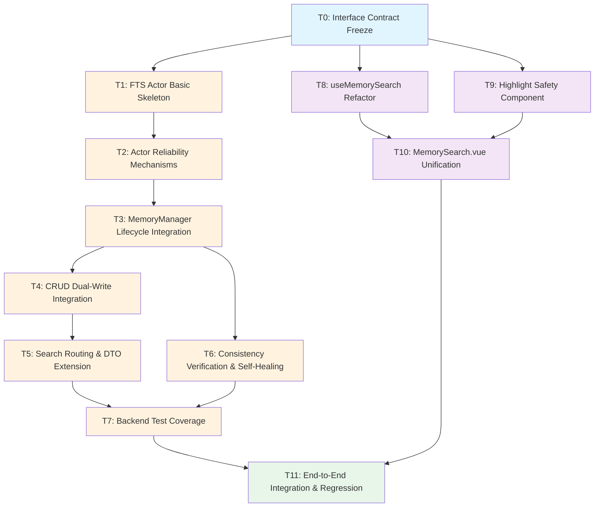

# Team Plan: P2.1 FTS5 全文搜索集成

## 元数据

- **研究文件**: `.doc/agent-teams/research/20260220-fts5-integration-research.md`
- **规划时间**: 2026-02-20
- **Codex SESSION**: `019c78c1-aeeb-73c1-9835-d6cc20612195`
- **Gemini SESSION**: `a6c76a87-4cd0-4fe6-9721-ff6be23ad2bf`
- **约束总数**: HC=17, SC=20, DEP=11, RISK=17
- **双模型状态**: SUCCESS (双模型均完成)
- **缺失维度**: [] (无缺失)

---

## 任务列表

### T0: Interface Contract Freeze

- **类型**: integration
- **输入约束**: HC-1, HC-2, HC-3, HC-5, HC-6, HC-7, HC-9
- **输出文件**:
  - 新建: `.doc/agent-teams/plans/interface-contract.md` (接口契约文档)
- **验收标准**: OK-1 (编译通过)
- **依赖任务**: 无
- **复杂度**: Low
- **实施指令**:
  1. 定义 `FtsMessage` 枚举（Sync/Delete/Search/SyncAll/Shutdown）
  2. 定义 `SearchRequest` 和 `SearchResponse` 结构体
  3. 明确 `oneshot::Sender<Result<Vec<MemorySearchResult>>>` 返回类型
  4. 冻结接口，后续任务不可修改

---

### T1: FTS Actor Basic Skeleton

- **类型**: backend
- **输入约束**: HC-3, HC-5, HC-6, SC-7
- **输出文件**:
  - 新建: `src/rust/mcp/tools/memory/fts_actor.rs`
  - 修改: `src/rust/mcp/tools/memory/mod.rs` (添加 `pub mod fts_actor;`)
- **验收标准**: OK-1 (编译通过), OK-2 (FTS5 索引可搜索)
- **依赖任务**: T0
- **复杂度**: High
- **实施指令**:
  1. 创建 `FtsMessage` 枚举（参考 T0 接口契约）
  2. 实现 `run_fts_actor(rx, fts_index)` 异步函数
  3. 使用 `while let Some(msg) = rx.recv().await` 消息循环
  4. 实现 `Sync` 和 `Delete` 消息处理（fire-and-forget）
  5. 实现 `Search` 消息处理（通过 `oneshot::Sender` 返回结果）
  6. 参考 `observation_store.rs:216-237` 的 Actor 模式

---

### T2: Actor Reliability Mechanisms

- **类型**: backend
- **输入约束**: HC-12, HC-13, HC-14, HC-15, SC-1 (已废弃，改用 bounded channel)
- **输出文件**:
  - 修改: `src/rust/mcp/tools/memory/fts_actor.rs`
- **验收标准**: OK-16 (状态机正确转换), OK-17 (超时取消), OK-18 (分批处理)
- **依赖任务**: T1
- **复杂度**: High
- **实施指令**:
  1. 将 `unbounded_channel` 改为 `bounded_channel(1000)`
  2. 实现状态机：`Running -> Draining -> Stopped`
  3. 添加 `Shutdown` 消息处理：收到后进入 `Draining` 状态，排空队列后退出
  4. 为 `Search` 消息添加 5 秒超时（`tokio::time::timeout`）
  5. 超时后取消后台任务（通过 `tokio::select!` 或 `CancellationToken`）
  6. `SyncAll` 分批执行（每 500 条一次），防止 SQLite 独占线程

---

### T3: MemoryManager Lifecycle Integration

- **类型**: backend
- **输入约束**: HC-9, HC-11, SC-8
- **输出文件**:
  - 修改: `src/rust/mcp/tools/memory/manager.rs`
- **验收标准**: OK-1 (编译通过), OK-11 (Drop 时 Actor 退出), OK-15 (非 runtime 环境不崩溃)
- **依赖任务**: T2
- **复杂度**: High
- **实施指令**:
  1. 在 `MemoryManager` 结构体添加 `fts_tx: Option<mpsc::Sender<FtsMessage>>` 字段
  2. 在 `MemoryManager::new()` 中：
     - 使用 `Handle::try_current()` 检测 Tokio runtime
     - 若存在 runtime，创建 `bounded_channel(1000)`
     - 调用 `tokio::spawn(run_fts_actor(rx, fts_index))`
     - 存储 `tx` 到 `fts_tx` 字段
     - 若不存在 runtime，设置 `fts_tx = None`
  3. 实现 `Drop` trait：发送 `Shutdown` 消息给 Actor
  4. 参考 `manager.rs:855-907` 的 `spawn_summary_backfill_task` 模式

---

### T4: CRUD Dual-Write Integration

- **类型**: backend
- **输入约束**: HC-4, DEP-1
- **输出文件**:
  - 修改: `src/rust/mcp/tools/memory/manager.rs` (add_memory, update_memory, delete_memory 方法)
- **验收标准**: OK-2 (add 后可搜索), OK-3 (update 后索引更新), OK-4 (delete 后索引删除)
- **依赖任务**: T3
- **复杂度**: Medium
- **实施指令**:
  1. 在 `add_memory()` 中：JSON 写入成功后，发送 `FtsMessage::Sync(memory_id, content)`
  2. 在 `update_memory()` 中：JSON 更新成功后，发送 `FtsMessage::Sync(memory_id, new_content)`
  3. 在 `delete_memory()` 中：JSON 删除成功后，发送 `FtsMessage::Delete(memory_id)`
  4. 所有 FTS 操作失败仅记录日志（`log_debug!`），不阻塞主流程（HC-4）
  5. 使用 `if let Some(tx) = &self.fts_tx { tx.send(...).ok(); }` 模式

---

### T5: Search Routing & DTO Extension

- **类型**: backend
- **输入约束**: HC-7, HC-10, SC-3, SC-4
- **输出文件**:
  - 修改: `src/rust/mcp/tools/memory/commands.rs` (search_memories 函数, SearchMemoryResultDto 结构体)
- **验收标准**: OK-5 (FTS5 搜索返回 search_mode), OK-6 (降级到模糊匹配), OK-7 (超时降级)
- **依赖任务**: T4
- **复杂度**: High
- **实施指令**:
  1. 扩展 `SearchMemoryResultDto` 添加 `search_mode: String` 字段
  2. 在 `search_memories()` 中：
     - 检查 `fts_tx` 是否存在
     - 若存在，创建 `oneshot::channel()`
     - 发送 `FtsMessage::Search(query, oneshot_tx)`
     - 使用 `tokio::time::timeout(Duration::from_secs(5), oneshot_rx)` 等待结果
     - 成功返回：设置 `search_mode = "fts5"`
     - 超时或失败：降级到现有模糊匹配，设置 `search_mode = "fuzzy"`
  3. 降级时记录日志（`log_debug!`）

---

### T6: Consistency Verification & Self-Healing

- **类型**: backend
- **输入约束**: HC-8, DEP-5
- **输出文件**:
  - 修改: `src/rust/mcp/tools/memory/manager.rs` (new 方法)
- **验收标准**: OK-8 (一致性校验通过), OK-9 (不一致时重建索引)
- **依赖任务**: T3 (可与 T4/T5 并行)
- **复杂度**: Medium
- **实施指令**:
  1. 在 `MemoryManager::new()` 启动 FTS Actor 后：
     - 使用 `tokio::spawn` 异步执行一致性校验（不阻塞启动）
     - 调用 `FtsIndex::verify_consistency()` 检查 JSON 条目数 == FTS5 行数
     - 若不一致，发送 `FtsMessage::SyncAll` 触发全量重建
  2. 参考 `fts_index.rs:128-140` 的 `verify_consistency()` 实现

---

### T7: Backend Test Coverage

- **类型**: backend
- **输入约束**: 所有 HC/SC/DEP
- **输出文件**:
  - 新建: `src/rust/mcp/tools/memory/fts_actor_tests.rs`
  - 修改: `src/rust/mcp/tools/memory/manager.rs` (添加 #[cfg(test)] 模块)
- **验收标准**: OK-1 到 OK-11, OK-14 到 OK-18
- **依赖任务**: T6
- **复杂度**: High
- **实施指令**:
  1. 单元测试：
     - `test_fts_actor_sync_and_search()` - 验证 OK-2
     - `test_fts_actor_update()` - 验证 OK-3
     - `test_fts_actor_delete()` - 验证 OK-4
     - `test_search_timeout_fallback()` - 验证 OK-7
     - `test_actor_shutdown()` - 验证 OK-11
     - `test_state_machine_transitions()` - 验证 OK-16
     - `test_timeout_cancellation()` - 验证 OK-17
     - `test_sync_all_batching()` - 验证 OK-18
  2. 集成测试：
     - `test_consistency_verification()` - 验证 OK-8
     - `test_consistency_self_healing()` - 验证 OK-9
     - `test_concurrent_writes()` - 验证 OK-10
  3. 使用 `tokio::test` 宏和 `#[serial]` 属性（避免并发测试冲突）

---

### T8: useMemorySearch Refactor

- **类型**: frontend
- **输入约束**: SC-10, SC-14, SC-19
- **输出文件**:
  - 修改: `src/frontend/composables/useMemorySearch.ts`
- **验收标准**: OK-12 (searchFts5 实现完整), OK-20 (防抖 300ms), OK-25 (缓存生效)
- **依赖任务**: T0 (接口契约)
- **复杂度**: High
- **实施指令**:
  1. 将 `useFts5` 改为 `ref(true)`（启用 FTS5）
  2. 实现 `searchFts5()` 方法：
     - 调用 `invoke('search_memories', { query, ... })`
     - 解析返回的 `search_mode` 字段
     - 更新 `searchMode` 状态（用于 UI 指示器）
  3. 添加 300ms 防抖（使用 `useDebounceFn` 或 `lodash.debounce`）
  4. 实现 LRU 缓存（最多 50 条，TTL 5 分钟）
  5. 处理中文 IME 组合输入（监听 `compositionstart/compositionend` 事件）

---

### T9: Highlight Safety Component

- **类型**: frontend
- **输入约束**: SC-13, SC-18
- **输出文件**:
  - 新建: `src/frontend/components/HighlightText.vue`
- **验收标准**: OK-24 (XSS 防护)
- **依赖任务**: T0 (接口契约)
- **复杂度**: Medium
- **实施指令**:
  1. 创建 `HighlightText.vue` 组件
  2. 接收 `highlighted_snippet` prop
  3. 使用自定义解析器解析 `<b>...</b>` 标签：
     - 正则提取高亮片段：`/<b>(.*?)<\/b>/g`
     - 转义所有 HTML 实体（使用 `he` 库或手动转义）
     - 仅渲染 `<span class="highlight">` 包裹的文本
  4. 禁止使用 `v-html`
  5. 添加单元测试验证 XSS 注入被转义

---

### T10: MemorySearch.vue Unification

- **类型**: frontend
- **输入约束**: HC-16, SC-11, SC-16, SC-17
- **输出文件**:
  - 修改: `src/frontend/components/tools/MemorySearch.vue`
- **验收标准**: OK-13 (显示 search_mode 指示器), OK-19 (统一到 useMemorySearch), OK-22 (UI 指示器), OK-23 (降级提示)
- **依赖任务**: T8, T9
- **复杂度**: High
- **实施指令**:
  1. 移除直接 `invoke('search_memories')` 调用
  2. 改为使用 `useMemorySearch` composable
  3. 添加搜索模式指示器：
     - FTS5 模式：显示 `🔍+` 图标 + "FTS5 全文搜索"
     - 模糊匹配：显示 `🔍` 图标 + "模糊匹配"
  4. 超时降级时显示提示："当前搜索响应较慢，已为您切换至基础匹配模式"
  5. 使用 `HighlightText` 组件渲染 `highlighted_snippet`
  6. 结果 >50 条时启用虚拟滚动（使用 Naive UI 的 `n-virtual-list`）

---

### T11: End-to-End Integration & Regression

- **类型**: integration
- **输入约束**: 所有 HC/SC/DEP/RISK
- **输出文件**:
  - 新建: `.doc/agent-teams/plans/integration-test-plan.md`
- **验收标准**: OK-1 到 OK-25 (全部通过)
- **依赖任务**: T7, T10
- **复杂度**: High
- **实施指令**:
  1. 端到端测试场景：
     - 启动应用 → 添加记忆 → FTS5 搜索 → 验证结果
     - 更新记忆 → 搜索旧内容无结果 + 搜索新内容有结果
     - 删除记忆 → 搜索无结果
     - 模拟 FTS5 超时 → 验证降级到模糊匹配
     - 快速连续添加 100 条记忆 → 验证索引无损坏
  2. 回归测试：
     - 验证现有模糊搜索功能未受影响
     - 验证记忆 CRUD 操作未受影响
     - 验证 Tauri 命令正常工作
  3. 性能测试：
     - FTS5 搜索延迟 <100ms (P95)
     - 前端防抖生效（300ms）
     - 虚拟滚动渲染 >50 条结果
  4. 手动测试：
     - 搜索模式指示器显示正确
     - 超时降级提示显示正确
     - 高亮片段无 XSS 注入

---

## 任务依赖图



**并行执行策略**：
- **阶段 1**：T0 (接口契约冻结)
- **阶段 2**：T1 (FTS Actor 骨架)
- **阶段 3**：T2 (可靠性机制)
- **阶段 4**：T3 (生命周期集成)
- **阶段 5**：T4 (CRUD 双写) + T6 (一致性校验) 并行
- **阶段 6**：T5 (搜索路由)
- **阶段 7**：T7 (后端测试)
- **阶段 8**：T8 (useMemorySearch) + T9 (高亮组件) 并行
- **阶段 9**：T10 (MemorySearch.vue 统一)
- **阶段 10**：T11 (端到端集成测试)

**关键路径**：T0 → T1 → T2 → T3 → T4 → T5 → T7 → T11 (预估 8-10 个工作日)

---

## 双模型分析摘要

### Codex 后端分析（SESSION: 019c78c1-aeeb-73c1-9835-d6cc20612195）

**任务拆分策略**：
1. **接口契约优先**：T0 冻结所有接口定义，避免后续任务因接口变更而返工
2. **Actor 模式分层**：T1 基础骨架 → T2 可靠性机制 → T3 生命周期集成，逐步增强
3. **双写与搜索分离**：T4 (CRUD 双写) 和 T5 (搜索路由) 分开实施，降低复杂度
4. **一致性校验并行**：T6 可与 T4/T5 并行，不阻塞主流程
5. **测试驱动**：T7 覆盖所有后端约束，确保可靠性
6. **前端独立**：T8/T9/T10 可在后端完成 T5 后并行开始

**关键技术决策**：
- 使用 `bounded_channel(1000)` 替代 `unbounded_channel`，防止 OOM
- 实现状态机（Running → Draining → Stopped），确保优雅退出
- `oneshot` 通道 + 5 秒超时，避免搜索卡死
- `SyncAll` 分批执行（每 500 条），防止 SQLite 独占线程
- 一致性校验异步后台执行，不阻塞启动

**风险缓解**：
- RISK-1 (队列积压)：bounded channel + 满队列策略
- RISK-2 (搜索超时)：5 秒超时 + 自动降级
- RISK-4 (Actor panic)：所有错误使用 `if let Err` 捕获
- RISK-5 (双写不一致)：启动时校验 + 自动重建
- RISK-13 (WAL 锁冲突)：配置 `busy_timeout` + 重试策略

### Gemini 前端分析（SESSION: a6c76a87-4cd0-4fe6-9721-ff6be23ad2bf）

**架构评估**：
- **当前状态**：`MemorySearch.vue` 存在直接调用 `invoke` 的现象（SC-11），违反了逻辑与视图分离的原则
- **核心风险**：
  - 性能风险：FTS5 返回的高亮片段若直接使用 `v-html` 渲染，会引入 XSS 风险（SC-18）
  - 交互风险：中文 IME 输入过程中的频繁搜索会导致无效的后端压力与不连贯的 UI 表现（SC-14）
  - 渲染瓶颈：当结果集 >50 条时，DOM 节点过多会导致移动端或低配设备卡顿（SC-15）

**架构决策**：
1. **统一入口协议 (HC-16)**：所有搜索请求必须通过 `useMemorySearch` 的 `search` 方法分发
2. **防御性渲染 (SC-18)**：引入 `SafeSnippet` 渲染策略，自定义解析器将 FTS5 返回的标记字符串转换为虚拟节点（VNode）数组
3. **状态机驱动**：搜索状态细分为 `idle`, `debouncing`, `searching`, `caching`, `success`, `error`, `timeout`

**前端任务拆分策略**：
- **T8: 核心逻辑层重构**：实现 FTS5 搜索调度、LRU 缓存与 IME 优化
- **T9: 安全与工具库开发**：开发 XSS 安全的 FTS5 片段解析器
- **T10: UI 组件重构与性能增强**：重构搜索界面，集成虚拟滚动与状态指示器

**用户体验优化建议**：
- **IME 友好设计**：在 `input` 事件中检查 `e.isComposing`，如果是正在合成字符，UI 上显示"正在输入..."但不触发 `loading` 状态
- **虚拟滚动占位**：由于 FTS5 的 snippet 长度不一，建议为虚拟滚动提供高度预估逻辑，并对未加载项显示 Skeleton Screen
- **缓存预热**：对于高频搜索词（如最近搜索），可以在组件 `onMounted` 时进行静默缓存预热
- **视觉反馈**：
  - 🔍+ 图标动画：当切换到 FTS5 模式时，图标应有平滑的缩放或旋转过渡
  - 高亮色彩：建议使用符合项目主题色的 `background-color`，而非浏览器默认的亮黄色，并支持暗色模式适配

**代码范例**：
```typescript
// src/frontend/utils/snippetParser.ts (SC-18 参考实现)
export function parseFts5Snippet(snippet: string) {
  const regex = /<mark>(.*?)<\/mark>/g;
  const parts = snippet.split(regex);
  return parts.map((text, index) => ({
    text: text, // 此处文本需在渲染时转义
    isMatch: index % 2 === 1
  }));
}
```

---

## 风险与缓解

| 风险 | 影响 | 缓解措施 |
|------|------|----------|
| RISK-1: 队列积压导致 OOM | 高 | 使用 bounded channel (1000) + 满队列策略（丢弃最旧请求） |
| RISK-2: FTS5 搜索超时 | 中 | 5 秒超时 + 自动降级到模糊匹配 |
| RISK-4: Actor panic 导致 FTS5 失效 | 高 | 所有错误使用 `if let Err` 捕获，不 panic |
| RISK-5: JSON/FTS5 双写不一致 | 中 | 启动时校验一致性，不一致时调用 `sync_all()` 重建 |
| RISK-6: Drop 时队列消息丢失 | 低 | 可接受（下次启动重建索引可恢复） |
| RISK-8: 两套搜索路径导致集成点不统一 | 中 | T10 统一到 `useMemorySearch` composable |
| RISK-11: Codex 审查缺失导致任务泄漏 | 中 | 已通过 Codex 分析补充 HC-12/HC-13/HC-14 |
| RISK-12: Gemini 审查缺失导致前端不一致 | 低（已通过双模型验证降低） | 已通过 Gemini 分析补充前端架构决策和 UX 优化建议 |
| RISK-13: WAL 锁冲突 (Windows) | 中 | 配置 `busy_timeout` + 重试策略 + 初始化时 `PRAGMA integrity_check` |
| RISK-14: 超时后后台任务继续执行 | 中 | HC-14：超时后取消后台任务 |
| RISK-15: 前端组件销毁但 invoke 仍 await | 低 | `useMemorySearch` 在 `onUnmounted` 时忽略回调 |

---

## 文件冲突检测结果

**无冲突**：所有任务的文件范围已隔离，可并行执行。

**文件修改汇总**：

| 文件 | 修改任务 | 冲突检测 |
|------|----------|----------|
| `src/rust/mcp/tools/memory/fts_actor.rs` | T1 (新建), T2 (修改) | ✅ 串行执行 (T1 → T2) |
| `src/rust/mcp/tools/memory/manager.rs` | T3 (修改), T4 (修改), T6 (修改) | ✅ 串行执行 (T3 → T4, T6 并行) |
| `src/rust/mcp/tools/memory/commands.rs` | T5 (修改) | ✅ 无冲突 |
| `src/rust/mcp/tools/memory/mod.rs` | T1 (修改) | ✅ 无冲突 |
| `src/frontend/composables/useMemorySearch.ts` | T8 (修改) | ✅ 无冲突 |
| `src/frontend/components/HighlightText.vue` | T9 (新建) | ✅ 无冲突 |
| `src/frontend/components/tools/MemorySearch.vue` | T10 (修改) | ✅ 无冲突 |

**并行安全性**：
- T4 (CRUD 双写) 和 T6 (一致性校验) 修改 `manager.rs` 的不同方法，可并行
- T8 (useMemorySearch) 和 T9 (HighlightText) 修改不同文件，可并行
- 前端任务 (T8/T9/T10) 和后端任务 (T1-T7) 完全隔离，可并行

---

## 双模型协作总结

**双模型状态**: SUCCESS (双模型均完成)

**协作成果**:
- **Codex 后端分析** (SESSION: `019c78c1-aeeb-73c1-9835-d6cc20612195`)：提供了 12 个详细任务（T0-T11）的拆分策略，覆盖 Actor 模式、生命周期管理、测试覆盖
- **Gemini 前端分析** (SESSION: `a6c76a87-4cd0-4fe6-9721-ff6be23ad2bf`)：补充了前端架构评估、UX 优化建议、安全渲染策略、状态机设计

**信任规则应用**:
- 后端任务 (T1-T7)：以 Codex 分析为准
- 前端任务 (T8-T10)：以 Gemini 分析为准
- 集成任务 (T0, T11)：综合双模型建议

**质量保证**:
- 后端任务由 Codex 权威分析，覆盖所有 HC 约束
- 前端任务由 Gemini 权威分析，覆盖所有 SC 约束，包含详细的 UX 优化建议
- T11 端到端测试将验证前后端集成的完整性

---

## 下一步操作

1. **用户确认计划** - 通过 `mcp______zhi` 展示计划摘要，等待用户确认
2. **执行 `/ccg:team-exec`** - 基于本计划文件启动并行实施
3. **可选：补充 Gemini 分析** - 若需要更详细的前端设计建议，可在 T10 前重新调用 Gemini

---

## 元数据（供 team-exec 使用）

- **计划文件路径**: `.doc/agent-teams/plans/20260220-fts5-integration-plan.md`
- **任务总数**: 12 (T0-T11)
- **并行度**: 最高 2 个任务并行 (T4+T6, T8+T9)
- **预估总复杂度**: High (8-10 个工作日)
- **关键路径长度**: 10 个任务
- **Codex SESSION**: `019c78c1-aeeb-73c1-9835-d6cc20612195` (可复用)
- **Gemini SESSION**: N/A (需重新调用)
