# 三术 (sanshu) - 项目文档

> **AI 辅助编程增强系统 | MCP 协议集成 | Tauri + Vue 3 + Rust**

## 变更记录 (Changelog)

### 2026-02-19 - 上下文检索优化（P0-P3）架构变更
- 32 步大规模实施，涵盖 P0-P3 全部优先级
- 新增 7 个 Rust 模块（hot_reload, metrics, keyring, migration, cache x2, errors 扩展）
- 新增 9 个前端文件（3 组件 + 2 composables + i18n 框架 + Pinia store + 测试）
- 记忆管理升级：SharedMemoryManager 并发保护、版本控制（快照/回滚）、原子写入
- 搜索引擎升级：混合检索（BM25 + 向量语义 + RRF 融合）、本地向量索引、多提供者嵌入
- 增强工具升级：统一 Chat 客户端、三级降级链（Ollama → 云端 API → 规则引擎）、结果缓存
- 基础设施：配置热更新（5s 间隔）、MCP 指标收集（P50/P95/P99）、统一错误分类、密钥安全存储
- 前端基础设施：vitest + happy-dom 测试框架、vue-i18n 国际化、Pinia 状态持久化
- 扫描 ~204 源文件（104 Rust + 42 TypeScript + 58 Vue），15 个核心模块

### 2026-02-18 - 完整扫描更新
- 扫描 ~184 源文件（97 Rust + 33 TypeScript + 54 Vue）
- 识别 15 个核心模块，全部生成模块级 CLAUDE.md
- 补充 MCP 客户端配置示例、数据流图、覆盖率报告

### 2026-02-18 - 初始化扫描
- 生成项目文档结构
- 识别 14 个核心模块
- 建立模块索引与导航

---

## 项目愿景

三术 (sanshu) 是一个集成了**智 (zhi)**、**记 (ji)**、**搜 (sou)** 三大核心能力的 AI 辅助编程增强系统。通过 MCP (Model Context Protocol) 协议与 AI 助手深度协同，实现从被动应答到主动协作的范式转变。

**核心理念**：道生一，一生二，二生三，三生万物

---

## 架构总览

### 技术栈
- **前端**：Vue 3 + Vite + UnoCSS + Naive UI + Pinia + vue-i18n
- **后端**：Rust + Tauri 2.0
- **协议**：MCP (Model Context Protocol) 2024-11-05
- **通信**：stdio 传输 + JSON-RPC 2.0
- **MCP SDK**：rmcp 0.12.0
- **测试**：Rust (cargo test) + 前端 (vitest + happy-dom)

### 双二进制架构
```
sanshu/
├── 等一下 (src/rust/main.rs)       # Tauri GUI 应用
└── 三术 (src/rust/bin/mcp_server.rs)  # MCP 服务器 (stdio)
```

### 数据流
```
AI 助手 (Claude/Cursor 等)
    |  stdio (JSON-RPC 2.0)
    v
ZhiServer (rmcp 0.12.0)
    |-- hot_reload  --> 配置热更新（5s 缓存刷新）
    |-- metrics     --> 指标收集（P50/P95/P99 延迟）
    |
    |-- zhi       --> GUI 弹窗 (Tauri IPC)
    |-- ji        --> SharedMemoryManager --> .sanshu-memory/memories.json
    |               |-- 并发保护 (Arc<RwLock>)
    |               |-- 版本控制（快照/回滚）
    |               |-- 原子写入（写临时文件 + rename）
    |               +-- 数据迁移（v1.0 -> v2.0 -> v2.1）
    |-- sou       --> 混合检索引擎
    |               |-- BM25 关键词检索
    |               |-- 向量语义检索（本地索引 + 多提供者嵌入）
    |               |-- RRF 融合排序
    |               +-- 三层缓存（内存 LRU -> 磁盘 -> API）
    |-- enhance   --> 统一 Chat 客户端
    |               |-- L1: Ollama 本地
    |               |-- L2: 云端 API (OpenAI/Gemini/Anthropic 等)
    |               |-- L3: 规则引擎降级
    |               +-- 结果缓存（LRU + TTL）
    |-- context7  --> Context7 API
    |-- tu        --> iconfont.cn API
    |-- uiux      --> 嵌入式 CSV 数据库
    +-- skill_*   --> Python 脚本执行
```

### 模块结构图

```mermaid
graph TD
    A["(根) 三术项目"] --> B["前端模块"];
    A --> C["后端模块"];

    B --> B1["src/frontend"];
    B1 --> B11["components (58个)"];
    B1 --> B12["composables (20个)"];
    B1 --> B13["theme / types / i18n / stores"];

    C --> C1["src/rust/app"];
    C --> C2["src/rust/mcp"];
    C --> C3["src/rust/telegram"];
    C --> C4["src/rust/network"];
    C --> C5["src/rust/ui"];
    C --> C6["src/rust/config"];

    C2 --> C20["hot_reload + metrics"];
    C2 --> C21["tools/interaction (zhi)"];
    C2 --> C22["tools/memory (ji)"];
    C2 --> C23["tools/acemcp (sou)"];
    C2 --> C24["tools/enhance"];
    C2 --> C25["tools/context7"];
    C2 --> C26["tools/icon (tu)"];
    C2 --> C27["tools/uiux"];
    C2 --> C28["tools/skills"];

    click B1 "./src/frontend/CLAUDE.md" "查看前端模块文档"
    click C1 "./src/rust/app/CLAUDE.md" "查看应用模块文档"
    click C2 "./src/rust/mcp/CLAUDE.md" "查看 MCP 模块文档"
    click C21 "./src/rust/mcp/tools/interaction/CLAUDE.md" "查看交互工具文档"
    click C22 "./src/rust/mcp/tools/memory/CLAUDE.md" "查看记忆工具文档"
    click C23 "./src/rust/mcp/tools/acemcp/CLAUDE.md" "查看搜索工具文档"
    click C24 "./src/rust/mcp/tools/enhance/CLAUDE.md" "查看增强工具文档"
    click C25 "./src/rust/mcp/tools/context7/CLAUDE.md" "查看文档查询工具文档"
    click C26 "./src/rust/mcp/tools/icon/CLAUDE.md" "查看图标工坊文档"
    click C27 "./src/rust/mcp/tools/uiux/CLAUDE.md" "查看 UI/UX 工具文档"
    click C28 "./src/rust/mcp/tools/skills/CLAUDE.md" "查看技能运行时文档"
    click C3 "./src/rust/telegram/CLAUDE.md" "查看 Telegram 模块文档"
    click C4 "./src/rust/network/CLAUDE.md" "查看网络模块文档"
    click C5 "./src/rust/ui/CLAUDE.md" "查看 UI 模块文档"
    click C6 "./src/rust/config/CLAUDE.md" "查看配置模块文档"
```



---

## 模块索引

| 模块路径 | 语言 | 职责 | 文件数 | 文档 |
|----------|------|------|--------|------|
| **前端** | | | | |
| src/frontend | Vue 3 + TypeScript | 前端 UI 界面（组件、composables、i18n、stores） | ~100 | [查看](./src/frontend/CLAUDE.md) |
| **后端 - 应用层** | | | | |
| src/rust/app | Rust | Tauri 应用构建、CLI、Tauri 命令 | 5 | [查看](./src/rust/app/CLAUDE.md) |
| src/rust/config | Rust | 配置读写（settings + storage + keyring 密钥安全存储） | 4 | [查看](./src/rust/config/CLAUDE.md) |
| src/rust/ui | Rust | 窗口管理、音频、自动更新 | 10 | [查看](./src/rust/ui/CLAUDE.md) |
| **后端 - MCP 服务器** | | | | |
| src/rust/mcp | Rust | MCP 服务器核心（ZhiServer + 路由 + 热更新 + 指标） | 7+7 | [查看](./src/rust/mcp/CLAUDE.md) |
| src/rust/mcp/tools/interaction | Rust | 智能交互 zhi（GUI 弹窗 + 历史） | 4 | [查看](./src/rust/mcp/tools/interaction/CLAUDE.md) |
| src/rust/mcp/tools/memory | Rust | 全局记忆 ji（并发安全 + 版本控制 + 快照/回滚 + 迁移） | 7 | [查看](./src/rust/mcp/tools/memory/CLAUDE.md) |
| src/rust/mcp/tools/acemcp | Rust | 代码搜索 sou（混合检索 + 本地向量索引 + 多层缓存） | 9 | [查看](./src/rust/mcp/tools/acemcp/CLAUDE.md) |
| src/rust/mcp/tools/enhance | Rust | 提示词增强（统一 Chat 客户端 + 三级降级 + 缓存） | 11 | [查看](./src/rust/mcp/tools/enhance/CLAUDE.md) |
| src/rust/mcp/tools/context7 | Rust | 框架文档查询（Context7 API） | 4 | [查看](./src/rust/mcp/tools/context7/CLAUDE.md) |
| src/rust/mcp/tools/icon | Rust | 图标工坊 tu（搜索 + SVG 转 PNG） | 5 | [查看](./src/rust/mcp/tools/icon/CLAUDE.md) |
| src/rust/mcp/tools/uiux | Rust | UI/UX 设计检索（嵌入式 CSV） | 8 | [查看](./src/rust/mcp/tools/uiux/CLAUDE.md) |
| src/rust/mcp/tools/skills | Rust | 技能运行时（Python 脚本动态加载） | 1 | [查看](./src/rust/mcp/tools/skills/CLAUDE.md) |
| **后端 - 集成** | | | | |
| src/rust/telegram | Rust | Telegram Bot 集成 | 6 | [查看](./src/rust/telegram/CLAUDE.md) |
| src/rust/network | Rust | 网络代理检测与地理位置 | 5 | [查看](./src/rust/network/CLAUDE.md) |

---

## 新增能力概览（v0.5.0 P0-P3）

| 能力 | 优先级 | 说明 |
|------|--------|------|
| 记忆版本控制 | P0 | 快照/回滚机制，每条记忆保留最近 5 个版本 |
| SharedMemoryManager | P0 | Arc<RwLock> 并发保护 + 原子写入 |
| 数据迁移框架 | P0 | v1.0 (MD) -> v2.0 (JSON) -> v2.1 (带版本/快照) |
| 混合检索引擎 | P1 | BM25 + 向量语义 + RRF 融合排序 |
| 本地向量索引 | P1 | 增量更新、并发安全、500MB 磁盘空间限制 |
| 多提供者嵌入 | P1 | Jina / SiliconFlow / Cloudflare / Nomic / Cohere / Ollama |
| 三层缓存 | P1 | 内存 LRU -> 磁盘持久化 -> API 回源 |
| 统一 Chat 客户端 | P1 | 三级降级：Ollama -> 云端 API -> 规则引擎 |
| 密钥安全存储 | P2 | 系统凭据管理器（keyring），避免明文存储 |
| 配置热更新 | P2 | 5 秒缓存刷新间隔 |
| MCP 指标收集 | P2 | P50/P95/P99 延迟、缓存命中率、错误率 |
| 统一错误分类 | P2 | McpToolError 枚举 + 可重试判断 |
| 前端测试框架 | P3 | vitest + happy-dom + v8 覆盖率 |
| i18n 国际化 | P3 | vue-i18n，中英双语 |
| IPC 弹性调用 | P3 | useSafeInvoke（超时 + 错误管理 + 加载状态） |
| 搜索状态持久化 | P3 | Pinia + persistedstate |

---

## 运行与开发

### 环境要求
- **Rust**: 1.70+
- **Node.js**: 18+
- **pnpm**: 10.28.2

### 开发命令
```bash
# 安装依赖
pnpm install

# 启动开发服务器（GUI）
pnpm tauri:dev

# 构建生产版本
pnpm tauri:build

# 运行 MCP 服务器（stdio 模式）
cargo run --bin 三术

# 运行 Rust 测试
cargo test

# 运行前端测试
pnpm vitest

# 运行前端测试（覆盖率）
pnpm vitest --coverage

# 调试模式（详细日志）
RUST_LOG=debug cargo run --bin 三术
```

### MCP 客户端配置

在 `claude_desktop_config.json` 或 `~/.cursor/mcp.json` 中添加：

```json
{
  "mcpServers": {
    "sanshu": {
      "command": "path/to/三术.exe",
      "args": [],
      "env": {
        "RUST_LOG": "info"
      }
    }
  }
}
```

### 配置文件位置
- **Windows**: `%APPDATA%\sanshu\config.json`
- **macOS/Linux**: `~/.config/sanshu/config.json`

```json
{
  "mcp_config": {
    "tools": {
      "zhi": true,
      "ji": true,
      "sou": false,
      "enhance": false,
      "context7": true,
      "uiux": true
    }
  }
}
```

---

## 测试策略

### Rust 单元测试
- `src/rust/mcp/tools/memory` - 相似度算法、去重、格式迁移、版本控制
- `src/rust/mcp/tools/uiux` - 设计系统搜索引擎
- `src/rust/telegram` - Markdown 处理
- `src/rust/network` - 代理检测、地理位置

### 前端测试（vitest + happy-dom）
- `src/frontend/components/tools/__tests__/EnhanceConfig.spec.ts` - 增强配置组件
- `src/frontend/components/tools/__tests__/SouConfig.spec.ts` - 搜索配置组件
- `src/frontend/components/tools/MemoryList.spec.ts` - 记忆列表组件
- `src/frontend/composables/useSafeInvoke.spec.ts` - IPC 弹性调用

### 测试运行
```bash
# Rust 测试
cargo test
cargo test --package sanshu --lib mcp::tools::memory

# 前端测试
pnpm vitest
pnpm vitest --coverage

# 运行带输出的 Rust 测试
cargo test -- --nocapture
```

---

## 编码规范

### Rust 代码
- 使用 `rustfmt` 格式化代码
- 遵循 Rust 2021 Edition 规范
- 公共 API 必须有文档注释 (`///`)
- 错误处理使用 `McpToolError`（统一错误分类）或 `anyhow::Result`

### TypeScript/Vue 代码
- 使用 ESLint + Antfu 配置
- 组件使用 `<script setup>` 语法
- 类型定义放在 `src/frontend/types/` 目录
- Composables 放在 `src/frontend/composables/` 目录
- 国际化文本放在 `src/frontend/i18n/` 目录
- 状态管理使用 Pinia，store 放在 `src/frontend/stores/` 目录

### 提交规范
- 使用语义化提交信息（Conventional Commits）
- 格式：`<type>(<scope>): <subject>`
- 类型：`feat`, `fix`, `docs`, `style`, `refactor`, `test`, `chore`

---

## AI 使用指引

### 添加新的 MCP 工具
```rust
// 1. 在 src/rust/mcp/tools/ 创建新模块目录
// 2. 实现 get_tool_definition() 返回 Tool 定义
// 3. 实现 call_tool() 处理工具调用
// 4. 在 server.rs list_tools() 中注册（可选：读取配置决定是否启用）
// 5. 在 server.rs call_tool() 中添加路由分支
// 6. 添加单元测试和 CLAUDE.md 文档
// 7. 错误处理使用 McpToolError 统一枚举
```

### 添加新的前端组件
```vue
<!-- 1. 在 src/frontend/components/ 对应分类目录创建组件 -->
<!-- 2. 使用 Naive UI 组件库 -->
<!-- 3. 遵循响应式设计，使用 UnoCSS 工具类 -->
<!-- 4. 在 src/frontend/types/ 添加 TypeScript 类型 -->
<!-- 5. 使用 i18n 的 useI18n() 获取翻译文本 -->
<!-- 6. IPC 调用使用 useSafeInvoke() 包装 -->
```

---

## 常见问题 (FAQ)

### Q: 如何调试 MCP 服务器？
A: 设置环境变量 `RUST_LOG=debug` 并运行 `cargo run --bin 三术`

### Q: 如何添加新的 MCP 工具？
A: 参考 `src/rust/mcp/tools/` 下的现有工具，实现相同的模块结构，详见上方"添加新的 MCP 工具"

### Q: 前端如何调用 Rust 后端？
A: 使用 `useSafeInvoke()` composable 包装 Tauri 的 `invoke` API，提供超时和错误处理

### Q: 如何配置 Telegram Bot？
A: 在设置页面填写 Bot Token 和 Chat ID，或直接编辑配置文件

### Q: sou 工具为什么默认关闭？
A: sou 需要建立代码库索引，首次运行有延迟，按需在配置中启用

### Q: 如何开发自定义技能（Skill）？
A: 在 `skills/` 目录创建子目录，添加 `SKILL.md` 和 Python 脚本，详见 [skills 模块文档](./src/rust/mcp/tools/skills/CLAUDE.md)

### Q: API 密钥存储在哪里？
A: 通过 `SecureKeyStore` 存储在系统凭据管理器中（Windows Credential Manager / macOS Keychain / Linux Secret Service），避免明文存储

### Q: 如何查看 MCP 性能指标？
A: 通过 `McpMetrics` 全局实例获取工具调用次数、缓存命中率、P50/P95/P99 延迟等指标

---

## 相关资源

- **GitHub 仓库**: https://github.com/yuaotian/sanshu
- **MCP 协议**: https://modelcontextprotocol.io/
- **Tauri 文档**: https://tauri.app/
- **Vue 3 文档**: https://vuejs.org/
- **Rust 文档**: https://www.rust-lang.org/

---

## 许可证

MIT License - 详见 [LICENSE](./LICENSE) 文件

---

**最后更新**: 2026-02-19
